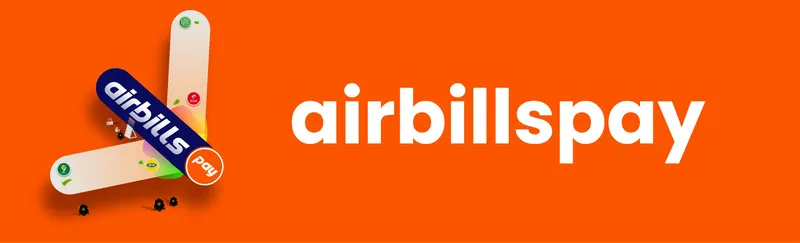

# Introduction

<figure><figcaption></figcaption></figure>

[Airbills](https://app.airbillspay.com/) Pay is a Solana-based digital payment platform that simplifies financial transactions, including bill payments, airtime purchases, and more. By utilizing Solana’s high-speed, low-cost blockchain, it ensures fast, secure, and reliable services tailored to meet the needs of a global user base.

Airbills Pay transforms the way payments are made by bridging the gap between traditional payment methods and blockchain technology. With Airbills, users can skip conventional methods and make seamless transactions directly on the Solana blockchain, offering a faster, more secure, and more modern way to pay their bills.
