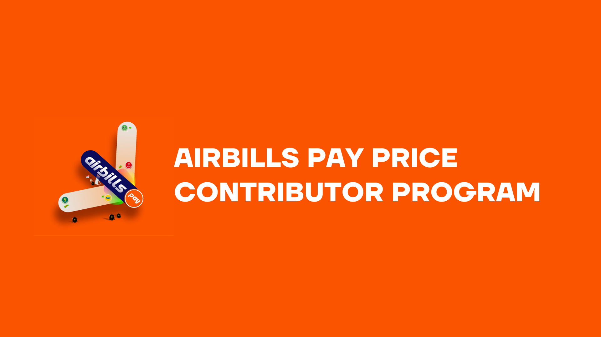

# Introduction

<figure><figcaption></figcaption></figure>

## **Welcome to the Airbills Pay Price Contributor Program**

_<mark style="background-color:orange;">**Thank you for your interest in becoming a Price Contributor for Airbills Pay!**</mark>_&#x20;

This document outlines the responsibilities, expectations, and benefits of being part of our team. Our Price Contributors play a crucial role in enhancing the accuracy and efficiency of pricing on our platform, and we value your efforts with a shared revenue model.

## **Who is a Price Contributor?**

A Price Contributor provides accurate pricing data for specific digital assets, fiat currencies, and other tradable instruments within the Airbills Pay ecosystem.

Their role is essential to maintaining transparency, reliability, and trust in our platform.
