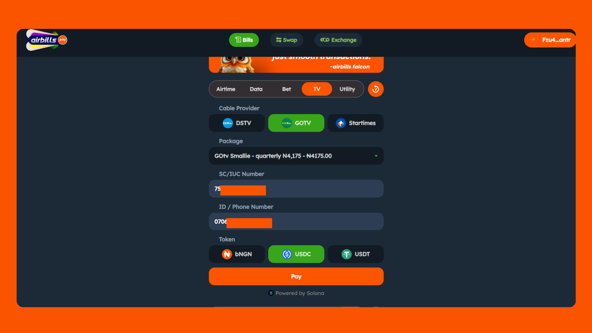

# Paying for TV Subscriptions

<figure><figcaption></figcaption></figure>

### **Access the Platform:**

* Go to [Airbills Pay](https://app.airbillspay.com/) and connect your Web3 wallet.

### **Select TV:**

* Click on the **TV** tab.
* Select your **Cable Provider** from the dropdown menu.
* Enter the **SC/IUC Number** for the TV subscription.

### **Make Payment:**

* Choose your subscription package from the list.
* Enter your phone number for confirmation.
* Pay with **USDC** or **USDT** (**bNGN** is in development).

### **Confirm and Complete:**

* Input the amount, click **PAY**, and confirm the transaction in your wallet.
